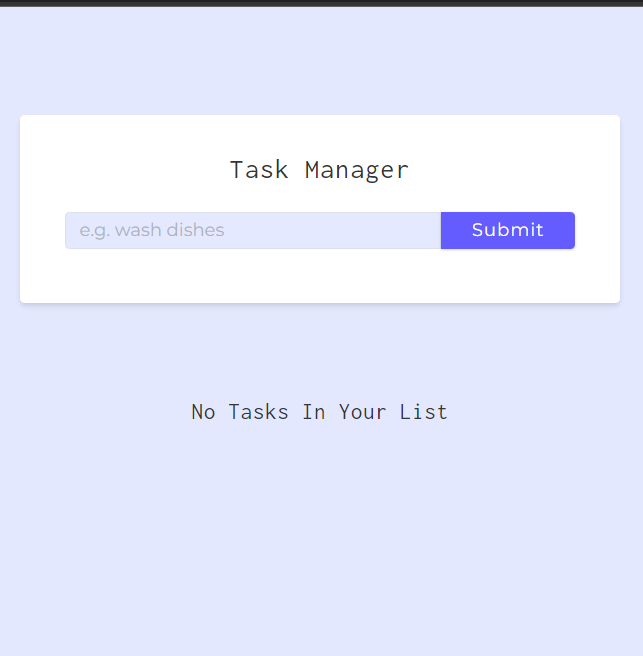

##sample img:

##How this project will be different from any other regular todo list app

  responsible for setting up the api that communicates whith cloud database and persist the data to the cloud
and its a CRUD (Create, Read, Update, Delete)api:

[https://www.mongodb.com/docs/drivers/node/current/fundamentals/crud/#crud-operations]

## Project Setup
### `npm start`

Runs the app in the development mode.\
Open [http://localhost:3000](http://localhost:3000) to view it in your browser.

The page will reload when you make changes.\
You may also see any lint errors in the console.

In order to run the project, setup .env and set MONGO_URI variable equal to DB connection string.

In order to avoid port collisions, in the source code port value is 3000